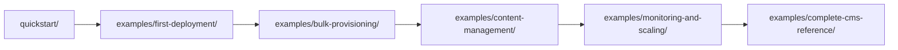

# BrightDev - Getting Started with BrightSign

**Build your CMS integration in hours, not weeks.**

BrightDev is your starting point for BrightSign development—quickstart guides, working examples, and copy-paste templates to get you building fast. 

> Part of [BrightDeveloper](https://github.com/BrightDevelopers) — BrightSign's AI-first developer program

---

## 🚀 Start Here

**Never used BrightSign before?**  
→ [quickstart/](quickstart/) — Make your first API call in 15 minutes

**Building a CMS or integration?**  
→ [examples/](examples/) — Journey-mapped examples from first player to scaling

**Want copy-paste starter code?**  
→ [templates/](templates/) — Complete project templates including Kotlin

**Need AI help while coding?**  
→ [tools/mcp-server/](tools/mcp-server/) — Connect Claude/Copilot to BrightSign docs

---

## 📍 Quick Navigation

| I want to... | Go to... |
|--------------|----------|
| Make my first API call | [quickstart/](quickstart/) |
| Deploy to my first player | [examples/first-deployment/](examples/first-deployment/) |
| Provision 10+ players at once | [examples/bulk-provisioning/](examples/bulk-provisioning/) |
| Manage content deployment | [examples/content-management/](examples/content-management/) |
| Scale to 100+ players | [examples/monitoring-and-scaling/](examples/monitoring-and-scaling/) |
| See a complete CMS implementation | [examples/complete-cms-reference/](examples/complete-cms-reference/) |
| Use the Go SDK | [sdk/go/](sdk/go/) |
| Start a Kotlin CMS project | [templates/kotlin-cms-starter/](templates/kotlin-cms-starter/) |

---

## 🗺️ The CMS Engineer Journey

BrightDev is organized around your integration journey:

Each stage builds on the previous one, taking you from "Hello World" to production-ready.

---

## 🧰 What's in This Repo

### [quickstart/](quickstart/)
Get to working code in 15 minutes. Authentication, first API call, and first player deployment.

### [examples/](examples/)
Complete, runnable examples mapped to your integration journey:
- **[first-deployment/](examples/first-deployment/)** — Register and activate your first player
- **[bulk-provisioning/](examples/bulk-provisioning/)** — Provision 10+ players efficiently
- **[content-management/](examples/content-management/)** — Upload and deploy content
- **[monitoring-and-scaling/](examples/monitoring-and-scaling/)** — Monitor health, handle failures
- **[complete-cms-reference/](examples/complete-cms-reference/)** — Full CMS architecture example

### [templates/](templates/)
Copy-paste project starters:
- **[minimal-cms/](templates/minimal-cms/)** — Bare-bones CMS in ~200 lines
- **[kotlin-cms-starter/](templates/kotlin-cms-starter/)** — Kotlin/JVM CMS template

### [sdk/go/](sdk/go/)
Reference implementation of BSN.cloud integration. Even if you're not using Go, the patterns here (auth, error handling, pagination) apply to any language.

### [tools/mcp-server/](tools/mcp-server/)
Connect your AI assistant to BrightSign documentation for AI-powered development.

---

## 🔗 When You Need More

**BrightDev is for getting started.** When you need deeper technical details:

- 📚 **[Technical Documentation](https://github.com/BrightDevelopers/technical-documentation)** — Complete API reference, BrightScript guides, advanced topics
- 💻 **[Player Examples](https://github.com/BrightDevelopers/player-examples)** — On-player development (Chromium, Node.js, local APIs)
- 📦 **[gopurple SDK](https://github.com/BrightDevelopers/gopurple)** — Production-ready Go SDK with 73 working examples

---

## 💡 AI-First Development

Every guide and example in BrightDev is designed to work with AI assistants. Paste any README into Claude, Copilot, or Cursor and get working code.

For the best AI-assisted experience:
1. Install the [MCP Server](tools/mcp-server/)
2. Your AI can now query BrightSign docs directly
3. Generate correct integration code on first try

---

## 🆘 Need Help?

- **Questions?** [GitHub Discussions](https://github.com/BrightDevelopers/discussions)
- **Community** [BrightSign Forums](https://forum.brightsign.biz)
- **Support** [brightsign.biz/support](https://brightsign.biz/support)

---

## 🎯 Philosophy

**Goal:** Your first successful API call in under 15 minutes.

**Strategy:** Remove all friction between "I want to integrate BrightSign" and "I have a working deployment."

**How:** Clear navigation, working examples, copy-paste templates, and AI assistance.

Start with [quickstart/](quickstart/) →
