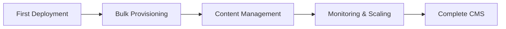

# Examples - Journey-Mapped Integration Guides

Each example corresponds to a stage in your BrightSign integration journey. Start with **first-deployment** and progress through each stage as your needs grow.

---

## 📍 The Journey



---

## 🚀 Stage 1: First Deployment

**[first-deployment/](first-deployment/)**

**Goal:** Register and activate a single BrightSign player  
**When:** You have 1 player and want to see it connect to BSN.cloud  
**What you'll learn:**
- Device registration via API
- Player activation process
- Basic device management

**Time:** 20 minutes

---

## 📦 Stage 2: Bulk Provisioning

**[bulk-provisioning/](bulk-provisioning/)**

**Goal:** Provision 10+ players efficiently using B-Deploy  
**When:** You need to deploy multiple players at once  
**What you'll learn:**
- B-Deploy API for automated setup
- Device setup configurations
- Batch operations

**Time:** 30 minutes

---

## 🎨 Stage 3: Content Management

**[content-management/](content-management/)**

**Goal:** Upload and deploy content to players  
**When:** You need to manage media files and presentations  
**What you'll learn:**
- Content upload API
- Presentation creation
- Content scheduling and deployment

**Time:** 45 minutes

---

## 📊 Stage 4: Monitoring & Scaling

**[monitoring-and-scaling/](monitoring-and-scaling/)**

**Goal:** Monitor player health and handle failures at scale  
**When:** Managing 50+ players in production  
**What you'll learn:**
- Health monitoring
- Remote diagnostics (RDWS)
- Error recovery patterns
- Performance optimization

**Time:** 60 minutes

---

## 🏗️ Stage 5: Complete CMS Reference

**[complete-cms-reference/](complete-cms-reference/)**

**Goal:** Understand complete CMS architecture  
**When:** Building a production CMS  
**What you'll learn:**
- Full architecture patterns
- State management
- Security best practices
- Multi-tenant design

**Time:** Study at your own pace

---

## 🧭 How to Use These Examples

### If you're brand new:
1. Start with [../quickstart/](../quickstart/) if you haven't already
2. Work through examples in order: 1 → 2 → 3 → 4 → 5
3. Each builds on concepts from the previous

### If you have specific needs:
- **"I just need to provision players"** → [bulk-provisioning/](bulk-provisioning/)
- **"I need to deploy content"** → [content-management/](content-management/)
- **"I'm scaling to production"** → [monitoring-and-scaling/](monitoring-and-scaling/)
- **"I want to see the big picture"** → [complete-cms-reference/](complete-cms-reference/)

### If you want to copy-paste:
The [templates/](../templates/) directory has starter projects ready to customize.

---

## 📚 Example Format

Each example follows this structure:

```
example-name/
└── README.md
    ├── Overview
    ├── What You'll Build
    ├── Prerequisites
    ├── Step-by-Step Guide (with code)
    ├── Complete Working Code
    ├── Troubleshooting
    └── Next Steps
```

Every code sample is:
- ✅ Complete (not a snippet)
- ✅ Runnable (copy-paste and go)
- ✅ Explained (why, not just what)
- ✅ AI-friendly (paste into Claude/Copilot)

---

## 🔗 Related Resources

**Need deeper API details?**  
→ [Technical Documentation](https://github.com/BrightDevelopers/technical-documentation)

**Want production-ready SDK?**  
→ [gopurple SDK](https://github.com/BrightDevelopers/gopurple)

**Building on-player apps?**  
→ [Player Examples](https://github.com/BrightDevelopers/player-examples)

---

[← Back to BrightDev](../README.md)
